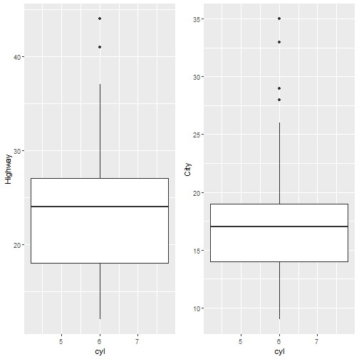

## Overview

1. Summary of the data set variables
2. Fuel economy based on number of Cylinders
3. Fuel economy based on type of Transmission
4. Fuel economy based on engine's diplacement in liters
5. Fuel economy based on class(Type) of car
6. Questions and Answers


--- .class #id 

## Summary of the data set variables


```
 manufacturer          model               displ            year     
 Length:234         Length:234         Min.   :1.600   Min.   :1999  
 Class :character   Class :character   1st Qu.:2.400   1st Qu.:1999  
 Mode  :character   Mode  :character   Median :3.300   Median :2004  
                                       Mean   :3.472   Mean   :2004  
                                       3rd Qu.:4.600   3rd Qu.:2008  
                                       Max.   :7.000   Max.   :2008  
      cyl           trans               drv                 cty       
 Min.   :4.000   Length:234         Length:234         Min.   : 9.00  
 1st Qu.:4.000   Class :character   Class :character   1st Qu.:14.00  
 Median :6.000   Mode  :character   Mode  :character   Median :17.00  
 Mean   :5.889                                         Mean   :16.86  
 3rd Qu.:8.000                                         3rd Qu.:19.00  
 Max.   :8.000                                         Max.   :35.00  
      hwy             fl               class          
 Min.   :12.00   Length:234         Length:234        
 1st Qu.:18.00   Class :character   Class :character  
 Median :24.00   Mode  :character   Mode  :character  
 Mean   :23.44                                        
 3rd Qu.:27.00                                        
 Max.   :44.00                                        
```


--- .class #id 

## Fuel economy based on number of Cylinders




--- .class #id 

## Fuel economy based on type of Transmission


--- .class #id 

## Fuel economy based on engine's diplacement in liters


--- .class #id 

## Fuel economy based on class(Type) of car


--- .class #id 

## Questions and Answers

--- .class #id 
